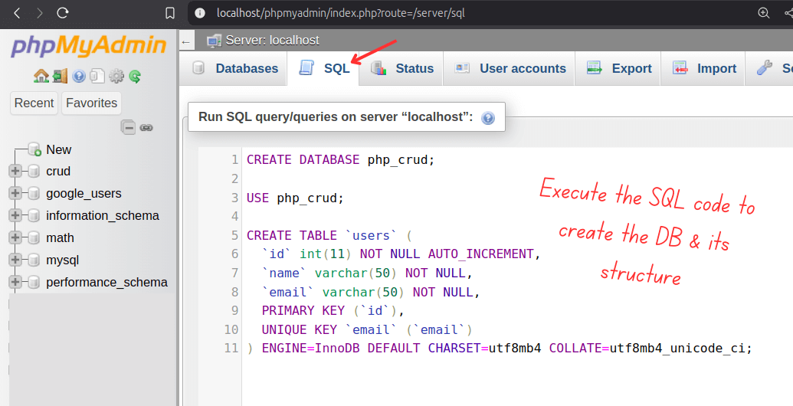
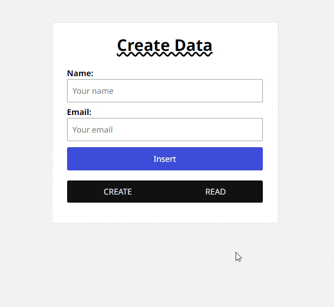

# PHP MySQL CRUD Application Project


CRUD applications are essential in web development for managing database data. In this tutorial, you'll learn how to setup a **basic CRUD (Create, Read, Update, Delete)** application, built using **PHP** and a **MySQL database**. We’ll use **PHP MySQLi OOP** for database interaction, and also provide alternative versions - **MySQLi** and **PDO**. Let's get started!

## How to setup this PHP MySQL CRUD App

### Prerequisites:

-   PHP (installed on your local server)
-   MySQL (using phpMyAdmin or any MySQL client)
-   Basic knowledge of PHP and MySQL

---

### Step 1: Set Up the Database

First, create a MySQL database and table to store user information.

-   **Database Name**: `php_crud`
-   **Table Name**: `users`

You can create the database and table using the following SQL:

```sql
CREATE DATABASE php_crud;

USE php_crud;

CREATE TABLE `users` (
  `id` int(11) NOT NULL AUTO_INCREMENT,
  `name` varchar(50) NOT NULL,
  `email` varchar(50) NOT NULL,
  PRIMARY KEY (`id`),
  UNIQUE KEY `email` (`email`)
) ENGINE=InnoDB DEFAULT CHARSET=utf8mb4 COLLATE=utf8mb4_unicode_ci;
```



---

### Step 2: Clone this Repository

1. Navigate to your local server’s root directory (usually `htdocs` or `www`).
2. Then clone this `chandan-tudu/php-mysql-crud-app` Repo, or you can dwonload as the ZIP file and then extract it here.

Inside the `php-mysql-crud-app` folder, you can see three versions of this project you can use any of them:

```plaintext
php-mysql-crud-app/
├── mysqli
├── mysqli-oop
└── pdo
```

---

### Step 3: Test the PHP CRUD Application

To test your CRUD application, enter the following URL on your browser after starting your local server and completing the above steps:

You can change the database name as you wish `db_connection.php`.

```
http://localhost/php-mysql-crud-app/mysqli-oop/create.php
```

Ensure your MySQL server and database are running. You should be able to add, view, edit, and delete users.


